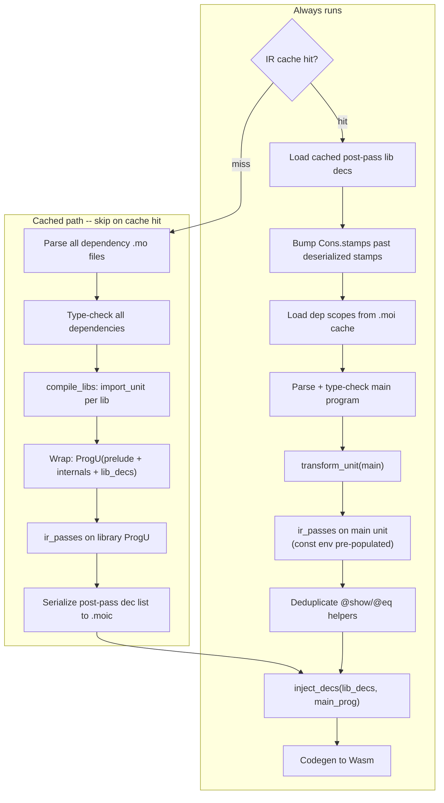

# Compile-mode IR Caching

## Problem

When compiling with `moc -c`, **89% of the time** is spent on whole-program IR passes + codegen that walk library code unchanged between builds. Profiling `Map.test.mo` (78 deps, 15k+ lines of library code vs 1.6k main):

| Phase | Time | % |
|---|---|---|
| Parse + check + definedness (per-lib) | 167ms | 11% |
| Lowering (desugar) | 61ms | 4% |
| **7 IR passes (whole-program)** | **1,076ms** | **73%** |
| Codegen | 164ms | 11% |

The current `.moi` scope cache saves ~58ms (3%) because it only helps type-checking. Libraries dominate the IR (~90% of code), so the IR passes spend ~970ms walking unchanged library code.

## Architecture

The key idea: **process library decs and main program decs through IR passes independently, then combine for codegen.**

The main program runs through passes WITHOUT the prelude or library decs in its IR. The passes generate variable references (e.g., `@text_of_option`) by name only — resolution happens at link time in the combined IR. `const.ml` receives all cached binding names as a pre-populated initial env.



### Cache interaction rules

The `.moi` scope cache and `.moic` IR cache interact:

- **IR cache hit**: load cached IR, use `.moi` scope cache to build `senv` for type-checking the main program. `libs` list is empty (not needed).
- **IR cache miss**: bypass `.moi` scope cache entirely — run full type-checking to produce annotated ASTs (`libs` list), then lower + pass + cache IR. The `.moi` scope cache is NOT used because we need the typed ASTs that `check_lib` produces as a side effect.

## Why it works

We analyzed all 7 IR passes for compositionality:

- **`erase_typ_field` / `async`**: Each uses a `con_renaming` that clones type constructors. Independent cloning produces structurally equivalent results. Codegen and `typ_hash` work structurally (not by stamp identity). The passes' own comments already anticipate fragment-wise execution ("if we run this translation on two program fragments, we would have to pass down the `con_renaming`").
- **`show` / `eq`**: Generate helpers named `@show<typ_hash>` / `@eq<typ_hash>`. `typ_hash` normalizes through `Con` (line 136 of `typ_hash.ml`), so independent fragments produce identical helper names. Duplicates between lib and main are deduplicated at link time.
- **`await` / `tailcall`**: Purely local per-function transformations. No cross-boundary dependencies.
- **`const`**: Top-level functions are unconditionally `surely_true` (line 110 of `const.ml`). Library exports are all top-level module values. We pre-populate the main program's const env with ALL binding names from `passed_lib_decs` (prelude + internals + library modules).

## Implementation

### Step 1: CLI changes ([moc.ml](src/exes/moc.ml))

Remove the restriction that `--moi-cache` requires `--check`. Allow it with `-c` as well. The same cache directory serves both:
- `.moi` files for scope caching (speeds up `--check`)
- `.moic` file for IR caching (speeds up `-c`)

Change in [moc.ml](src/exes/moc.ml) around line 403:
```ocaml
(* Remove this check: *)
(* if Option.is_some !Flags.moi_cache_dir && !mode <> Check
   then fail "moc: --moi-cache requires --check"; *)
```

### Step 2: Fresh name scoping ([construct.ml](src/ir_def/construct.ml), [cons.ml](src/mo_types/cons.ml))

**Variable names** — `Construct.fresh` generates names like `$k/0`. Cached and fresh sessions could collide. Add a library scope prefix:

```ocaml
(* construct.ml *)
let ir_scope = ref ""

let fresh name_base () : string =
  let n = Lib.Option.get (Stamps.find_opt name_base !id_stamps) 0 in
  id_stamps := Stamps.add name_base (n + 1) !id_stamps;
  if !ir_scope = "" then Printf.sprintf "$%s/%i" name_base n
  else Printf.sprintf "$%s$%s/%i" !ir_scope name_base n
```

Set `Construct.ir_scope := "libs"` before processing libraries for IR passes, reset to `""` before processing the main program.

**Constructor stamps** — `Cons.clone` (used by `erase_typ_field` and `async`) calls `Cons.fresh_stamp` which uses a global counter. After `Marshal` deserialization, cached `Cons.t` objects have stamps from a previous session but the counter is NOT bumped. Add a function to bump past deserialized stamps:

```ocaml
(* cons.ml *)
let bump_stamps_past cs =
  List.iter (fun c ->
    let (n, scope) = c.stamp in
    let key = (c.name, scope) in
    let cur = Lib.Option.get (Stamps.find_opt key !stamps.stamps) 0 in
    if n >= cur then
      stamps := { !stamps with stamps = Stamps.add key (n + 1) !stamps.stamps }
  ) cs
```

Call `bump_stamps_past` after deserializing cached IR, passing all `Cons.t` found in the deserialized decs.

### Step 3: Const pass modification ([const.ml](src/ir_passes/const.ml))

Accept an optional initial env with pre-known constant bindings. This must include ALL binding names from `passed_lib_decs` — prelude functions (`@text_of_option`, `@new_async`, etc.), internals, library modules (`file$/path/to/Map.mo`), and any generated `@show<...>` / `@eq<...>` helpers.

```ocaml
let analyze ?(known_const = []) ((cu, _flavor) : prog) =
  let init_env = List.fold_left (fun env name ->
    M.add name { loc_known = true; const = surely_true } env
  ) M.empty known_const in
  match cu with
  | LibU _ -> raise (Invalid_argument "cannot compile library")
  | ProgU ds -> decs_ TopLvl init_env ds
  | ActorU (as_opt, ds, fs, sys, typ) ->
    let env = match as_opt with
      | None -> init_env
      | Some as_ -> args TopLvl init_env as_
    in
    let (env', _) = decs TopLvl env ds in
    exp_ TopLvl env' sys.preupgrade;
    exp_ TopLvl env' sys.postupgrade;
    exp_ TopLvl env' sys.heartbeat;
    exp_ TopLvl env' sys.timer;
    exp_ TopLvl env' sys.inspect;
    exp_ TopLvl env' sys.low_memory;
    exp_ TopLvl env' sys.stable_record
```

The `pipeline.ml` call changes from `Const.analyze prog` to `Const.analyze ~known_const prog`.

### Step 4: IR serialization ([ir_cache.ml](src/pipeline/ir_cache.ml) — new file)

Use `Marshal` for the POC. Cache validity is ensured by compiler version hash.

```ocaml
let magic = "MOIC"
let version = 1

let write file ~compiler_hash ~dep_hash (decs : Ir.dec list) =
  let tmp = file ^ ".tmp" in
  let oc = open_out_bin tmp in
  output_string oc magic;
  output_binary_int oc version;
  output_string oc compiler_hash;   (* Source_id.id, 40 hex chars *)
  output_string oc dep_hash;        (* SHA-256 of all dep source hashes *)
  Marshal.to_channel oc decs [];
  close_out oc;
  Sys.rename tmp file

let read file ~compiler_hash ~dep_hash : Ir.dec list option =
  try
    let ic = open_in_bin file in
    Fun.protect ~finally:(fun () -> close_in ic) (fun () ->
      let magic' = really_input_string ic (String.length magic) in
      let version' = input_binary_int ic in
      let compiler' = really_input_string ic (String.length compiler_hash) in
      let dep' = really_input_string ic (String.length dep_hash) in
      if magic' <> magic || version' <> version
         || compiler' <> compiler_hash || dep' <> dep_hash
      then None
      else Some (Marshal.from_channel ic : Ir.dec list))
  with Sys_error _ | End_of_file | Failure _ -> None
```

**Cache key**: SHA-256 of the sorted `(resolved_path, MD5(source))` list for all dependencies. Cache file: `<dep_hash>.moic` in the `--moi-cache` directory.

**Post-deserialization**: collect all `Cons.t` stamps from the deserialized decs and call `Cons.bump_stamps_past` to prevent collisions.

### Step 5: Pipeline restructuring ([pipeline.ml](src/pipeline/pipeline.ml))

Replace `compile_progs` to separate library and main processing. Key design decisions:

1. **No prelude in main fragment** — the main program's IR passes run on `transform_unit(main)` alone, without prelude/internals decs. Show/eq helpers generate `VarE` references resolved at link time. `const.ml` uses the pre-populated env.

2. **Cache-miss bypasses scope cache** — on IR cache miss, `chase_imports_cached` must NOT use `.moi` scope cache (we need annotated ASTs for lowering). Implement by temporarily clearing `Flags.moi_cache_dir` during `load_progs` when compiling with IR cache miss.

3. **Actor class guard** — if any library has an `ActorClassU` body, skip IR caching entirely and fall through to the current full pipeline. This avoids complex interaction with `compile_unit_to_wasm`.

```ocaml
and compile_progs mode do_link libs progs =
  match !Flags.moi_cache_dir with
  | Some cache_dir when not (has_actor_class_libs libs) ->
    compile_progs_cached mode do_link libs progs cache_dir
  | _ ->
    compile_progs_uncached mode do_link libs progs

and compile_progs_uncached mode do_link libs progs =
  (* current implementation, unchanged *)
  let imports = compile_libs mode libs in
  let prog = CompUnit.combine_progs progs in
  let u = CompUnit.comp_unit_of_prog false prog in
  compile_unit mode (!Flags.enhanced_migration) do_link imports u

and compile_progs_cached mode do_link libs progs cache_dir =
  let dep_hash = compute_dep_hash libs in
  let moic_path = Filename.concat cache_dir (dep_hash ^ ".moic") in
  let compiler_hash = Source_id.id in
  (* Phase A: try loading cached library IR *)
  let passed_lib_decs = match Ir_cache.read moic_path ~compiler_hash ~dep_hash with
    | Some decs ->
      (* Bump Cons stamp counter past any deserialized stamps *)
      let cons = collect_cons_from_ir_decs decs in
      Cons.bump_stamps_past cons;
      decs
    | None ->
      (* Cache miss — must have typed ASTs. If libs is empty because
         scope cache was used, we need to re-run load_progs without
         scope cache. For now, libs should be populated because
         compile_files calls load_progs before compile_progs. *)
      let prelude_imports =
        Lowering.Desugar.(import_prelude prelude @ import_prelude internals) in
      let lib_imports = compile_libs mode libs in
      let lib_prog =
        Ir.(ProgU (prelude_imports @ lib_imports)), Ir.full_flavor () in
      let (passed_cu, _flavor) = ir_passes mode lib_prog "libraries" in
      let decs = match passed_cu with
        | Ir.ProgU ds -> ds | _ -> assert false in
      Ir_cache.write moic_path ~compiler_hash ~dep_hash decs;
      decs
  in
  (* Phase B: main program IR — NO prelude, no library decs *)
  let prog = CompUnit.combine_progs progs in
  let u = CompUnit.comp_unit_of_prog false prog in
  let name = u.Source.note.Syntax.filename in
  let main_prog = Lowering.Desugar.transform_unit u in
  (* Run IR passes with pre-populated const env *)
  let lib_bindings = extract_binding_names passed_lib_decs in
  let passed_main_prog = ir_passes_with_env mode main_prog name ~known_const:lib_bindings in
  (* Phase C: combine + codegen *)
  let combined = inject_and_dedup_lib_decs passed_lib_decs passed_main_prog in
  compile_combined mode do_link combined name
```

**Helper functions needed:**

- `has_actor_class_libs libs` — scan `libs` for any `ActorClassU` body
- `compute_dep_hash libs` — SHA-256 of sorted `(filename, MD5(source))` pairs
- `extract_binding_names decs` — collect all `LetD`/`VarD`/`RefD` binding names from the dec list
- `collect_cons_from_ir_decs decs` — walk IR decs and collect all `Cons.t` objects (for stamp bumping)
- `inject_and_dedup_lib_decs lib_decs main_prog` — prepend lib decs to main prog, filtering out any `@show<...>` / `@eq<...>` decs from main that duplicate names in lib decs
- `ir_passes_with_env` — same as `ir_passes` but passes `~known_const` to `Const.analyze`
- `compile_combined` — run codegen on the combined IR (equivalent to current `compile_unit` but receiving a fully-linked prog)

### Step 6: Show/eq deduplication

In `inject_and_dedup_lib_decs`, collect the set of binding names from `passed_lib_decs` that match `@show<...>` or `@eq<...>`. Then filter the main program's decs to remove any `LetD` whose binding name is in that set.

```ocaml
let inject_and_dedup_lib_decs lib_decs (main_cu, main_flavor) =
  let lib_names = List.fold_left (fun s d ->
    match d.it with
    | Ir.LetD ({it = {Ir.var; _}; _}, _) -> StringSet.add var s
    | _ -> s
  ) StringSet.empty lib_decs in
  let filter_dup d = match d.it with
    | Ir.LetD ({it = {Ir.var; _}; _}, _)
      when String.length var > 5
        && (String.sub var 0 5 = "@show" || String.sub var 0 3 = "@eq<")
        && StringSet.mem var lib_names -> false
    | _ -> true
  in
  let deduped_cu = match main_cu with
    | Ir.ProgU ds -> Ir.ProgU (lib_decs @ List.filter filter_dup ds)
    | Ir.ActorU (a, ds, fs, sys, t) ->
      Ir.ActorU (a, lib_decs @ List.filter filter_dup ds, fs, sys, t)
    | Ir.LibU _ -> assert false
  in
  (deduped_cu, main_flavor)
```

### Step 7: Check_ir adjustment

Skip `Check_ir` on the combined post-link IR. Run it per-fragment only:
- **Library fragment**: run `Check_ir` before caching (in `compile_progs_cached`, after `ir_passes`)
- **Main fragment**: run `Check_ir` after passes but before linking

In `pipeline.ml`, `Check_ir` is called inside `desugar_unit` and each `*_translation` function via `if !Flags.check_ir then Check_ir.check_prog ...`. For the combined IR, guard the final check with a flag or simply skip it after linking.

### Step 8: Tests

1. **Correctness**: compile with `--moi-cache`, verify the output `.wasm` is byte-identical to compiling without cache
2. **Cache invalidation**: change a dependency source file, verify the cache is invalidated and a fresh compile produces correct output
3. **Actor class bypass**: test with actor class libraries, verify caching is skipped and compilation still works
4. **Error reporting**: type errors in main program are still reported correctly with cached deps

Test structure (extending existing `test/run/moi-cache/`):
```
//MOC-FLAG --moi-cache _out/moi-cache-dir
//MOC-FLAG -c
```

## Risks

1. **Constructor identity after independent cloning**: Codegen uses structural types for Wasm layout, so different clones of the same constructor produce identical Wasm. Verified by examining `typ_hash` (normalizes through `Con` at line 136) and codegen dispatch. Mitigated by `Cons.bump_stamps_past` to prevent stamp collisions.

2. **`Marshal` stability**: `Marshal` format is OCaml-version-dependent. Since we key caches by `Source_id.id` (which changes with every compiler build), stale caches from a different OCaml version are automatically rejected.

3. **Actor class libraries**: These go through `compile_unit_to_wasm` (full recursive compilation). For the POC, if ANY actor class library is present, IR caching is bypassed entirely. This is safe and simple.

4. **Scope cache / IR cache ordering**: On IR cache miss, the `.moi` scope cache must NOT be used because we need annotated ASTs (produced by `check_lib`) for lowering. The `compile_files` flow ensures `load_progs` runs first — if IR caching is enabled but misses, we need `libs` populated. This is handled by checking the IR cache AFTER `load_progs` returns. If `libs` is empty (scope cache was used), we re-run `load_progs` without scope cache.

5. **Main program passes without prelude decs**: The show/eq passes generate `VarE` references to prelude functions (`@text_of_option`, etc.) that don't exist in the main fragment's IR. This is safe because `VarE` is just a string reference — resolution happens in the combined IR at codegen. `const.ml` won't crash because all prelude bindings are in the pre-populated `known_const` env.

## Expected impact

On `Map.test.mo` with warm IR cache:

| Phase | Time |
|---|---|
| Startup + cache deserialization | ~100ms |
| Parse dep headers + scope cache | ~60ms |
| Parse + check main | ~10ms |
| Lower main | ~5ms |
| IR passes on main (~10% of IR) | ~110ms |
| Codegen (whole-program, not cached) | ~164ms |
| **Total** | **~450ms** |

- **Before**: 1,760ms (full compile)
- **After**: ~450ms
- **Savings**: ~1,310ms (74% faster)

Codegen (164ms) is the floor — it always walks the full combined IR. The savings scale with the ratio of library code to main program code. For projects with large dependency trees and small main programs (the typical case), savings could reach 75-80%.
