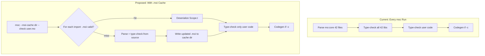

# Incremental Compilation for Motoko

## Current State

### How moc works today (batch compiler)

Every `moc` invocation (whether `--check` or `-c`) does the **full pipeline from scratch** for the entire dependency graph:

1. Parse all transitive `.mo` imports (DFS walk)
2. Type-check every library (`check_lib`) in dependency order
3. Accumulate `Scope.t` per library into a growing static environment
4. Type-check entrypoint program(s) against the accumulated environment
5. (If compiling) Desugar to IR, run IR passes, codegen to Wasm

For a project using `mo:core` (42 files, ~28k lines), steps 1-3 repeat identically on every single `moc` run — even if none of the library sources changed. This is the dominant cost for `mops check` and iterative development.

### The moc.js scope cache (fragile, in-memory only)

The JS API (`moc.js`) exposes a `scope_cache: Scope.t Type.Env.t` — a string-keyed map from resolved import paths to their typing scopes. The vscode-motoko language server passes this map across calls to skip re-type-checking unchanged dependencies.

**Why it's fragile:**

- Cache keys are **file paths**, not content hashes — no automatic invalidation
- Invalidation is entirely **client-side** (vscode-motoko manages a dependency graph and manually deletes stale entries)
- `Scope.t` values are **opaque blobs** passed through JS via `Obj.magic` — no serialization format, no disk persistence
- Type constructors (`Cons.t`) contain mutable `ref` cells and process-global stamps — not safely serializable with OCaml `Marshal`

### How mops invokes moc

`mops check` runs: `moc <file.mo> --check --package name1 path1 --package name2 path2 ...`

`mops build` runs: `moc -c --idl --stable-types -o output.wasm main.mo --package name1 path1 ...`

Each invocation is a fresh process. mops does **zero compilation caching** — it delegates everything to moc and expects moc to handle the full graph.

---

## How Other Languages Handle This

### OCaml (.cmi / .cmo files) — Simplest Model

Each `.ml` file compiles to:

- `.cmi` (compiled module interface) — serialized type signatures
- `.cmo` / `.cmx` (compiled object) — bytecode / native code

When compiling a file that imports module `Foo`, the compiler reads `foo.cmi` instead of re-type-checking `foo.ml`. Build tools (`dune`, `ocamlfind`) handle dependency ordering and cache invalidation via file timestamps.

**Key insight:** The compiler itself produces and consumes interface files. The build tool just orchestrates. Cache invalidation is trivially based on file modification time.

### TypeScript (.tsbuildinfo / .d.ts)

- `--incremental` saves a `.tsbuildinfo` file containing file hashes and a dependency graph
- On rebuild, compares file hashes against saved state, skips unchanged files
- Project references use `.d.ts` (declaration files) as compiled interfaces between sub-projects

### Rust (.rmeta / query-based)

- Full query-based dependency graph with content-addressed caching
- Extremely sophisticated — overkill for Motoko's current scale

### Recommendation: Follow the OCaml/TypeScript hybrid model

The simplest approach that gets 80%+ of the benefit is:

1. Serialize `Scope.t` to disk per library (like OCaml's `.cmi`)
2. Use content hashing for invalidation (like TypeScript's `.tsbuildinfo`)
3. Let mops orchestrate (like `dune` / `tsc --build`)

---

## Proposed Design: `.moi` Interface Cache Files

### Concept

Introduce a new file format `.moi` (Motoko Object Interface) that captures the type-checked `Scope.t` for a library module. When moc encounters an import, it can load the `.moi` file instead of parsing and type-checking the `.mo` source.

### Architecture




### Phase 1: Serialization of Scope.t (moc side)

The core challenge is that `Scope.t` contains `Type.t` values, which contain `Cons.t` (type constructors with mutable `ref` cells and global stamps). This makes naive `Marshal` unsafe.

**Approach: Canonical serialization with stamp remapping**

1. Walk the `Scope.t` and collect all referenced `con` values
2. Assign canonical integer IDs (deterministic, based on traversal order)
3. Serialize `Scope.t` to a binary format, replacing `con` pointers with canonical IDs and serializing their `kind` inline
4. Include a **format version** for forward/backward compatibility
5. Include a **Merkle fingerprint** for transitive invalidation (see below)

**Merkle fingerprint for transitive invalidation:**

A flat per-file content hash is insufficient. If library `A` imports `B`, and `B` changes, `A`'s cached scope is stale even though `A.mo` didn't change — because `A`'s `Scope.t` was computed against `B`'s old scope.

Each `.moi` header stores:

```
format_version: u32
source_hash: SHA-256 of this .mo file's content
scope_fingerprint: SHA-256(source_hash || sorted(dep_name:dep_scope_fingerprint, ...))
deps: [(dep_resolved_name, dep_scope_fingerprint), ...]
```

The `scope_fingerprint` is a Merkle hash — it changes if this file's source changes **or** if any transitive dependency's source changes (since each dep's fingerprint transitively includes its own deps).

**Validation on load** (works because `chase_imports_cached` processes in dependency order — by the time we validate `A.moi`, `B` has already been loaded/validated):

1. Compute `source_hash` of current `.mo` file content
2. Compare with stored `source_hash` — if different, **cache miss** (source changed)
3. For each `(dep_name, stored_dep_fingerprint)` in the `.moi` deps list, compare `stored_dep_fingerprint` against that dep's **current** `scope_fingerprint` (either from its freshly-validated `.moi` or from re-computation) — if any mismatch, **cache miss** (a dependency changed)
4. All match → **cache hit**, deserialize the `Scope.t`

This correctly propagates invalidation through the entire dependency chain: if a leaf library changes, every ancestor's fingerprint mismatches, triggering re-computation up the tree.

**Handling cyclic type constructors in serialization:**

Type constructors (`con`) can form cycles. For example, `type List = ?(Nat, List)` produces a con whose kind references itself: `Def([], Opt(Tup[Nat, Con(list_con, [])]))`. Mutually recursive types create multi-node cycles (`Tree` references `Forest`'s con; `Forest` references `Tree`'s con). A naive recursive serializer would loop forever.

The codebase already solves this exact graph-cycle problem in two places we can follow:

- `**ExpGraph.unfold`** ([expGraph.ml](src/lang_utils/expGraph.ml)): walks a cyclic type graph with a `seen` set, assigns integer IDs on first visit, emits back-references on revisit. Used by `typ_hash` to serialize cyclic types to canonical strings.
- `**open_binds`** ([type.ml](src/mo_types/type.ml) line 580): creates cons with `Pre` placeholder kinds, builds kind values that reference the already-existing cons, then fills in via `set_kind`. This is the "create-then-fixup" pattern.

The key insight is that by the time a `Scope.t` is returned from `check_lib`, **all cons are finalized** — no `Pre` placeholders remain. The `set_kind` guard (`Abs(_, Pre)` required) ensures write-once semantics. So the `ref` cell is effectively immutable at caching time; serialization just reads the final value.

**Serialization (writing `.moi`):**

1. Walk the scope, maintain a `con -> int` visited map
2. First encounter of a con: assign canonical ID, emit its name and kind body (recurse into the kind, which may encounter other cons — assign IDs to those too)
3. Re-encounter of a con already in the visited map: emit just the ID (back-reference, breaks the cycle)

**Deserialization (reading `.moi`):**

1. **First pass:** for each con definition in the file, create `Cons.fresh name (Abs([], Pre))` and register in an `int -> con` table. This mirrors how `open_binds` pre-allocates cons before their kinds are known.
2. **Second pass:** deserialize each con's kind body, resolving con-ID references via the lookup table. Because the cons already exist, cyclic references resolve to valid pointers.
3. `Type.set_kind` each con with its deserialized kind — the same mechanism the compiler already uses.
4. Rebuild `Scope.t` from the deserialized cons and types.

**Key files to modify:**

- New module: `src/mo_types/scope_serial.ml` (or similar) — serialize/deserialize `Scope.t`
- [pipeline.ml](src/pipeline/pipeline.ml) — add `.moi` loading path in `chase_imports_cached`
- [moc.ml](src/exes/moc.ml) — add `--moi-cache` flag

### Phase 2: moc CLI Integration

Single new flag:

- `--moi-cache <dir>` — use `<dir>` as a read/write cache for `.moi` files. On each import, check for a valid cached `.moi`; on cache miss, type-check from source and write the result back.

This is simpler than separate read/write flags — the cache is self-populating. First run pays full cost and warms the cache; subsequent runs benefit from it. No separate "generate cache" step needed.

Modified `chase_imports_cached` (note: imports are processed in dependency order, so all deps are resolved before their dependents):

```
# Maintained across the DFS traversal:
fingerprints: Map<resolved_name, scope_fingerprint>  # populated as each lib is processed

for each import (in dependency order):
  if --moi-cache is set:
    moi_path = <cache-dir>/<import-key>.moi
    if moi_path exists on disk:
      read .moi header (source_hash, scope_fingerprint, deps list)
      own_hash = SHA-256(current .mo file on disk)
      if own_hash != stored source_hash:
        CACHE MISS (source changed)
      else:
        for each (dep_name, stored_dep_fp) in deps:
          if fingerprints[dep_name] != stored_dep_fp:
            CACHE MISS (a dependency changed)
        if all deps match:
          CACHE HIT — deserialize Scope.t, adjoin to senv
          fingerprints[resolved_name] = stored scope_fingerprint
          continue to next import

    # Cache miss or no .moi file:
    parse + type-check from source
    compute scope_fingerprint
    write .moi to moi_path  (update cache)
    fingerprints[resolved_name] = scope_fingerprint
  else:
    normal parse + type-check (no caching)
```

### Phase 3: mops Integration

mops simply passes `--moi-cache .mops/.moi-cache/` to every moc invocation. No separate cache generation step is needed — the cache is self-populating:

1. **First `mops check` after install:** all cache misses, moc type-checks from source and populates the cache as a side effect
2. **Subsequent `mops check` / `mops build`:** cache hits for unchanged deps, only recomputes what changed
3. **After `mops install` (dependency update):** mops can optionally delete `.mops/.moi-cache/` for a clean slate, though Merkle fingerprints would correctly invalidate stale entries anyway

Package sources are **immutable** once installed — `mo:core@0.12.0` never changes on disk — so fingerprints always match between `mops install` runs. User-authored local libraries (e.g. `--package mylib ./src/lib`) can change freely, and the Merkle invalidation handles that correctly.

**Changes to mops:**

- [check.ts](~/mops/cli/commands/check.ts) — add `--moi-cache .mops/.moi-cache/` to moc args
- [build.ts](~/mops/cli/commands/build.ts) — add `--moi-cache .mops/.moi-cache/` to moc args
- Optionally: delete `.mops/.moi-cache/` during `mops install` for a clean slate

### Phase 4: vscode-motoko Integration (bonus)

The same `.moi` mechanism could replace the fragile in-memory scope cache:

- Language server reads `.moi` files from the mops cache directory
- No more client-side dependency graph tracking for invalidation
- Falls back to current behavior if no `.moi` files exist

---

## Key Design Decisions and Trade-offs

### Why not OCaml Marshal?

`Marshal.to_channel` might seem tempting, but has problems:

- **Cross-scope cons identity:** `Marshal` preserves `ref` sharing *within* a single marshaled value, so a single `Marshal.to_string scope` would correctly preserve internal cycles. However, if two separately marshaled scopes reference the same logical con, they'd get different `ref` cells on deserialization, breaking identity. This matters when the entrypoint's types reference cons from its dependencies.
- **Stamp collisions:** Deserialized stamps could collide with freshly-allocated ones in the same process. A custom deserializer can use `Cons.fresh` to get process-unique stamps.
- **No version safety:** Any change to the OCaml type definitions silently corrupts marshaled data — segfaults at runtime.
- **No selective invalidation:** Marshal is all-or-nothing; you can't embed Merkle fingerprints or validate individual deps.

A custom serializer is more work upfront but is safer and composes properly with the invalidation design. The `ExpGraph`-style graph traversal pattern already exists in the codebase and handles cycles correctly.

### Why not just speed up type-checking?

Even with a perfectly fast type-checker, re-doing the same work on every invocation is wasteful. A project with 10 package dependencies could have hundreds of library files — all immutable between dependency updates.

### Why Merkle fingerprints instead of flat content hashes or timestamps?

- **Flat content hashes are insufficient:** If library A imports B and B changes, A's cached scope is invalid even though A's source didn't change. The Merkle fingerprint (`hash(own_source, dep_fingerprints...)`) propagates changes transitively.
- **Timestamps are fragile:** Package files in `.mops/` can be re-installed (same content, new mtime). Content hashing is deterministic across machines (CI reproducibility).
- **Cost is negligible:** SHA-256 of a 28k-line library is ~1ms; the fingerprint check for the entire dep tree is O(n) string comparisons where n = number of direct deps per library.

### What about codegen caching?

For `--check` (the hot path during development), codegen doesn't run. For `-c` (build), the libraries don't produce Wasm individually (only the entrypoint does) — so scope caching covers the dominant cost. Actor class imports are an exception (each produces Wasm), but those are rare.

---

## Complexity Estimate


| Component            | Effort | Risk                                                                                                                                                                                                                              |
| -------------------- | ------ | --------------------------------------------------------------------------------------------------------------------------------------------------------------------------------------------------------------------------------- |
| Scope.t serializer   | Medium | Cyclic cons are handled by the `ExpGraph`-style visited-set + `open_binds`-style create-then-fixup pattern. Main work is covering all `Type.t` variants. The `ref` cells are effectively immutable at cache time — not a blocker. |
| moc CLI flags        | Low    | Straightforward flag plumbing                                                                                                                                                                                                     |
| Pipeline integration | Medium | Merkle fingerprint validation in `chase_imports_cached`, fingerprint map threading                                                                                                                                                |
| mops integration     | Low    | Adding flags to existing moc invocations + post-install hook                                                                                                                                                                      |
| vscode-motoko        | Low    | Optional, can use .moi files as drop-in replacement for scope cache                                                                                                                                                               |


---

## Simplest Viable Starting Point

If the full serialization story is too much, a **simpler first step** exists:

**Persistent moc daemon / long-running process**

Instead of serializing `Scope.t` to disk, keep a `moc` process alive between invocations:

- `moc --server` listens on a Unix socket or stdin/stdout
- mops sends check/compile requests
- The moc process maintains `scope_cache` in memory across requests
- Invalidation: mops tells moc which files changed (or moc watches with inotify)

This avoids the serialization problem entirely but requires a process management story in mops. It's conceptually similar to what TypeScript's `tsc --watch` and `tsserver` do.

**Trade-off:** Simpler implementation, but doesn't survive process restarts and adds operational complexity (daemon lifecycle, error recovery). The `.moi` approach is more robust long-term.

---

## Recommended Path

1. **Start with `.moi` for `--check` only** — this is the hot path during development
2. **Target `mo:core` and mops packages first** — immutable sources, simple invalidation
3. **Integrate with mops** — add `--moi-dir` passthrough, generate cache on `mops install`
4. **Later:** extend to full compilation, actor class caching, and language server integration

